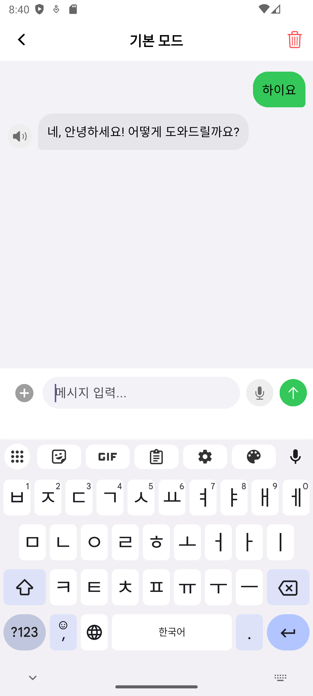
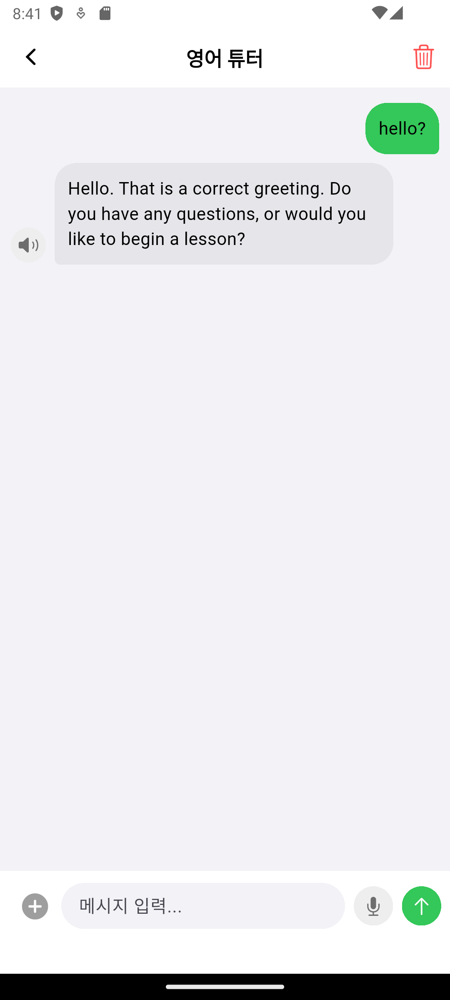

# My Gemini - Flutter AI Chatbot 🤖

Google's **Gemini 2.5 Flash** 모델을 활용한 Flutter 기반의 AI 채팅 애플리케이션입니다.
단순한 텍스트 대화를 넘어, 이미지 인식(Multi-modal), 음성 대화(STT/TTS), 그리고 상황에 맞는 페르소나 설정 기능을 제공합니다.

## ✨ 주요 기능 (Key Features)

* **⚡ Gemini 2.5 Flash 연동**: Google의 최신 생성형 AI 모델을 사용하여 빠르고 정확한 답변을 제공합니다.
* **🎭 멀티 페르소나 (Multi-Persona)**:
    * **기본 모드**: 친절한 한국어 AI 비서.
    * **영어 튜터 모드**: 엄격한 문법 교정 및 영어 회화 연습 파트너.
* **📷 멀티모달 지원 (Multi-modal)**: 텍스트뿐만 아니라 **카메라 촬영** 또는 **앨범 이미지**를 여러 장 첨부하여 질문할 수 있습니다.
* **🗣️ 음성 인식 및 합성 (STT & TTS)**:
    * **STT (Speech-to-Text)**: 타이핑 없이 말로 질문 입력 가능.
    * **TTS (Text-to-Speech)**: AI의 답변을 음성으로 듣기 (한국어/영어 자동 전환).
* **💾 대화 내용 저장**: `SharedPreferences`를 활용하여 앱을 종료해도 대화 기록이 유지됩니다.
* **📝 마크다운 렌더링**: 코드 블록, 강조 구문 등 AI의 답변을 깔끔한 서식으로 표시합니다.

## 🛠️ 기술 스택 (Tech Stack)

* **Framework**: Flutter
* **Language**: Dart
* **State Management**: `provider`
* **AI Model**: `google_generative_ai` (Gemini API)
* **Voice Features**: `speech_to_text` (STT), `flutter_tts` (TTS)
* **Local Storage**: `shared_preferences`
* **Environment**: `flutter_dotenv`

## 📱 스크린샷 (Screenshots)

|               홈 화면 (모드 선택)               |                     기본 모드                      |                       영어 티칭 모드                       |
|:----------------------------------------:|:----------------------------------------------:|:----------------------------------------------------:|
|  |  |  |


## 🚀 설치 및 실행 방법 (Getting Started)

### 1. 프로젝트 클론
```bash
git clone [https://github.com/Ugie01/Flutter_Gemini_For_Me.git](https://github.com/Ugie01/Flutter_Gemini_For_Me.git)
cd my-gemini-flutter
```
### 2. 패키지 설치
```bash
flutter pub get
```
### 3. 환경 변수 설정 (.env)
프로젝트 루트 디렉토리에 .env 파일을 생성하고, 발급받은 Gemini API Key를 입력하세요.

Note: API Key는 Google AI Studio에서 무료로 발급받을 수 있습니다.

```코드 스니펫
# .env file
GEMINI_API_KEY=your_api_key_here
```
### 4. 앱 실행
```bash
flutter run
```
## 📂 폴더 구조 (Project Structure)
```
lib/
├── controllers/
│   └── chat_controller.dart    # Gemini API, TTS/STT, 상태 관리 로직
├── models/
│   └── chat_message.dart       # 메시지 데이터 모델 (JSON 직렬화 포함)
├── views/
│   ├── home_screen.dart        # 모드 선택(페르소나) 화면
│   ├── chat_screen.dart        # 메인 채팅 인터페이스
│   └── widgets/
│       └── message_bubble.dart # 말풍선 위젯 (마크다운 & 이미지 표시)
└── main.dart                   # 앱 진입점 및 테마 설정
```
## ⚠️ 주의 사항
이 프로젝트는 Gemini API를 사용하므로 인터넷 연결이 필수적입니다.

Android/iOS 시뮬레이터 또는 실제 기기에서 마이크 및 카메라 권한 허용이 필요합니다.

iOS: Info.plist에 NSMicrophoneUsageDescription, NSCameraUsageDescription, NSPhotoLibraryUsageDescription 추가 필요.

Android: AndroidManifest.xml에 권한 설정 확인 필요.
